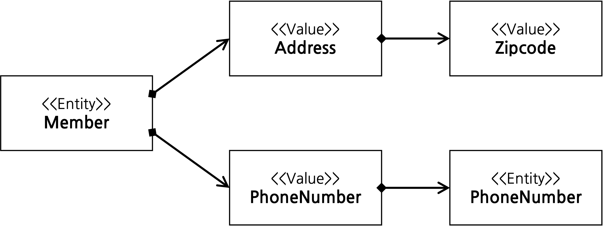
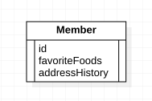
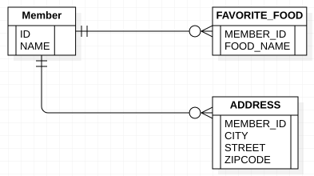

CHAPTER 09
===
[ 값 타입 ]
---


과정 요약
---

- JPA의 데이터 타입을 크게 분류하면 엔티티 타입과 값 타입으로 나눌 수 있다.  
  엔티티 타입은 ```@Entity```로 정의하는 객체이고, 값 타입은 ```int```, ```Integer```, ```String```와 같이 단순히 값으로 사용하는 자바의 기본 타입을 말한다.  
  엔티티 객체는 식별자를 통해 계속해서 추적이 가능하지만 값 타입은 그렇지 않다.

#### 값 타입

- 기본값 타입
    - 자바 기본 타입 ```int, long```
    - 래퍼 클래스 ```Integer, Long)```
    - String


- 임베디드 타입 ```복합 값 타입``` : JPA에서 사용자가 직접 정의한 값 타입
- 컬렉션 값 타입 : 하나 이상의 값 타입

<br><br>

## 기본값 타입

```java

@Entity
public class Member {
    @Id
    @GeneratedValue
    private Long id;

    private String name;
    private int age;
}
```

- ```Member``` 객체의 ```String```, ```int```가 값 타입이다.


- 엔티티의 인스턴스가 제거되면 내부의 값도 제거된다.  
  또한 값 타입은 공유하면 안된다. 예를 들어 다른 회원 엔티티의 이름을 변경한다고 해서 나의 이름까지 변경되면 안된다는 것이다.

<br><br>

## 임베디드 타입 (복합 값 타입)

- 새로운 값 타입을 직접 정의하여 사용할 수 있는데 JPA에서는 이것을 ```임베디다 타입```이라고 한다.  
  중요한 점은 직접 정의한 임베디드 타입도 ```int```, ```String```처럼 값 타입이라는 것이다.

    ```java
    @Entity
    public class Member {
        @Id
        @GeneratedValue
        private Long id;
        private String name;
    
        // 근무기간
        @Temporal(TemporalType.DATE)
        private Date startDate;
        
        @Temporal(TemporalType.DATE)
        private Date endDate;
    
        // 집 주소 표현
        private String city;
        private String street;
        private String zipCode;
    }
    ```
  <br>
- 위 예제는 평범한 엔티티의 모습이다. 다만 위의 코드에서 근무기간과 집주소의 경우 서로 아무 관련이 없어 각각을 아래와 같이 사용하는 것이 더 좋다.
    ```java
    @Entity
    public class Member {
        @Id
        @GeneratedValue
        private Long id;
        private String name;
    
        // 근무기간
        @Embedded
        private Period workPeriod;
    
        // 집 주소 표현
        @Embedded
        private Address homeAddress;
    }
    
    // 근무기간 임베디드 타입
    @Embeddable
    public class Period{
        @Temporal(TemporalType.DATE)
        private Date startDate;
        
        @Temporal(TemporalType.DATE)
        private Date endDate;
  
        public boolean isWork(Date date){
            // .. 값 타입을 위한 메소드를 정의할 수 있다. 
        }         
    } 
  
    // 주소 임베디드 타입
    @Embeddable
    public class Address{
        @Column(name = "city") // 매핑할 컬럼 정의 가능
        private String city;
        private String street;
        private String zipcode;
    }
    ```
    - 위와 같이 구성을 하게되면 장점은 회원 엔티티가 의미있게 응집력이 생긴다.
    - 새롭게 정의한 값 타입들을 재사용할 수 있는 장점도 있다.

#### 임베디드  타입을 사용 조건

- ```@Embeddable``` : 값 타입을 정의하는 곳에서 사용한다.
- ```@Embedded``` : 값 타입을 사용하는 곳에서 사용한다.

- 임베디드 타입을 사용하기 위해서는 기본 생성자가 필수다.

- 임베디드 타입을 포함한 모든 값 타입은 엔티티의 생명주기에 의존하므로 엔티티와 임베디드 타입의 관계를 UML로 표현하면 ```컴포지션```관계가 된다.
    - 하이버네이트는 임베디드 타입을 컴포넌트라고 한다.

<br><br>

### 임베디드 타입과 테이블 매핑

- 임베디드 타입은 엔티티의 값일 뿐이다.   
  테이블에서 사용되는 값은 예제에서 임베디드 타입을 사용하기 전과 동일하다.


- 임베디드 타입으로 인해 객체와 테이블을 아주 세밀하게 매핑하는 것이 가능하다.  
  잘 설계한 ORM 애플리케이션은 매핑한 테이블의 수보다 클래스의 수가 더 많다.


- ORM을 사용하지 않고 개발을 하게 되면 테이블 컬럼과 객체 필드를 대부분 1:1로 매핑을 하게 된다.
    - 위에서 사용한 주소나 근무 기간을 임베디드 타입을 적용시키지 않았다면 테이블과 객체를 1:1로 매핑을 하게 되어 고단한 작업이 될 것이다.

<br>

### 임베디드 타입과 연관관계

- 임베디드 타입은 값 타입을 포함하거나 엔티티를 참조할 수 있다.
    - 엔티티는 공유될 수 있으므로 참조한다고 표현하고, 값 타입은 특정 주인에 소속되고 논리적인 개념상 공유되지 않으므로 포함한다고 표현

<br>



```java
import javax.persistence.Embeddable;
import javax.persistence.Embedded;
import javax.persistence.Entity;
import javax.persistence.Id;
import javax.persistence.ManyToOne;

@Entity
public class Member {
    @Embedded
    private Address address; // 임베디드 타입 포함
    @Embedded
    private PnoneNumber pnoneNumber; // 임베디드 타입 포함
    // ..
}

@Embeddable
public class Address {
    private String street;
    private String city;
    private String state;

    @Embedded
    private Zipcode zipcode;
}

@Embeddable
public class Zipcode {
    private String zip;
    private String plusFour;
}

@Embeddable
public class PhoneNumber {
    private String areaCode;
    private String localNumber;

    @ManyToOne
    private PhoneServiceProvider provider; // 엔티티 참조
}

@Entity
public class PhoneServiceProvider {
    @Id
    private String name;
    // ...
}
```

- 예제를 보 값 타입인 ```Address```가 값 타입인 ```Zipcode```를 포함하고,  
  값 타입인 ```PhoneNumber```가 엔티티타입인 ```PhoneServiceProvider```를 참조한다.

### @AttributeOverride : 속성 재정의

- 임베디드 타입에 정의한 매핑정보를 재정의 하는 어노테이션이다.  
  어떠한 경우에 사용되냐면 ```Member``` 객체에 집 주소 외의 회사 주소를 넣게 된다면 ```Address```를 필드로 하나 더 생성할 것이다.  
  그럼 테이블에 겹치는 컬럼이 발생되어 문제가 발생되는데 이때 이 어노테이션을 사용하여 둘 중 하나의 컬럼명을 수정해줄 수 있다.

  ```java
  @Entity
  public class Member {
    @Id
    @GeneratedValue
    private Long id;
    private String name;
    private int age;
  
    @Embedded
    private Address homeAddress;
  
    @Embedded
    private Address companyAddress;
  }
  ```

- 위와 같은 경우이다. 어노테이션을 사용한 예제를 봐보자

<br>

#### 책 예제

```java

@Entity
public class Member {
    @Id
    @GeneratedValue
    private Long id;
    private String name;
    private int age;

    @Embedded
    private Address homeAddress;

    @Embedded
    @AttributeOverrides({
            @AttributeOverride(name = "city", column = @Column(name = "COMPANY_CIYT")),
            @AttributeOverride(name = "street", column = @Column(name = "COMPANY_STREET")),
            @AttributeOverride(name = "zipcode", column = @Column(name = "COMPANY_ZIPCODE"))})
    private Address companyAddress;
}
```

- 근데 난 이렇게 하면 지금 오류가 발생한다.

```
Exception in thread "main" javax.persistence.PersistenceException: [PersistenceUnit: jpabook] Unable to build Hibernate SessionFactory
	at org.hibernate.jpa.boot.internal.EntityManagerFactoryBuilderImpl.persistenceException(EntityManagerFactoryBuilderImpl.java:1597)
	at org.hibernate.jpa.boot.internal.EntityManagerFactoryBuilderImpl.build(EntityManagerFactoryBuilderImpl.java:1503)
	at org.hibernate.jpa.HibernatePersistenceProvider.createEntityManagerFactory(HibernatePersistenceProvider.java:56)
	at javax.persistence.Persistence.createEntityManagerFactory(Persistence.java:79)
	at javax.persistence.Persistence.createEntityManagerFactory(Persistence.java:54)
	at jpabook.chapter09.Application.main(Application.java:10)
Caused by: org.hibernate.MappingException: Repeated column in mapping for entity: jpabook.chapter09.Member column: plus_four (should be mapped with insert="false" update="false")
	at org.hibernate.mapping.PersistentClass.checkColumnDuplication(PersistentClass.java:895)
	at org.hibernate.mapping.PersistentClass.checkPropertyColumnDuplication(PersistentClass.java:913)
	at org.hibernate.mapping.PersistentClass.checkPropertyColumnDuplication(PersistentClass.java:909)
	at org.hibernate.mapping.PersistentClass.checkPropertyColumnDuplication(PersistentClass.java:909)
	at org.hibernate.mapping.PersistentClass.checkColumnDuplication(PersistentClass.java:935)
	at org.hibernate.mapping.PersistentClass.validate(PersistentClass.java:637)
	at org.hibernate.mapping.RootClass.validate(RootClass.java:267)
	at org.hibernate.boot.internal.MetadataImpl.validate(MetadataImpl.java:359)
	at org.hibernate.internal.SessionFactoryImpl.<init>(SessionFactoryImpl.java:314)
	at org.hibernate.boot.internal.SessionFactoryBuilderImpl.build(SessionFactoryBuilderImpl.java:471)
	at org.hibernate.jpa.boot.internal.EntityManagerFactoryBuilderImpl.build(EntityManagerFactoryBuilderImpl.java:1498)
	... 4 more
```

- ```Address``` 엔티티에 있는 임베디드 타입의 ```Zipcode```에서 발생되는 에러 같다.  
  임베디드 타입 안에 있는 값 또한 겹치는 문제로 ```Zipcode``` 내부의 타입들 또한 컬럼으로 만들어 버려 생기는 문제로 임베디드 타입인 ```Zipcode``` 또한 컬럼명을 명시적으로 변경해 줘야
  한다.. 방법을 찾아보자

  ```java
      @Embedded
      @AttributeOverrides({
              @AttributeOverride(name = "city", column = @Column(name = "COMPANY_CIYT")),
              @AttributeOverride(name = "street", column = @Column(name = "COMPANY_STREET")),
              @AttributeOverride(name = "state", column = @Column(name = "COMPANY_STATE")),
              @AttributeOverride(name = "zipcode.zip", column = @Column(name = "COMPANY_ZIP")),
              @AttributeOverride(name = "zipcode.plusFour", column = @Column(name = "COMPANY_PLUS_FOUR"))})
      private Address companyAddress;
  ```
    - 임베디드 타입이 중첩되어 내부의 내부 컬럼명을 변경하고자 한다면 위와 같이 `name` 속성에 `.`을 통해 내부 컬럼을 변경할 수 있다.

  <br><br>

### 임베디드 타입과 null

- 임베디드 타입이 `null`이면 매핑한 컬럼 값은 모두 `null`이 된다.

  ```java
  member.setAddress(null); // null 
  em.persist(member);
  ```

- 위와 같이 `Address`에 `null`을 넣게되면 `Address`의 내부 필드들은 모두 `null`이 된다.

<br><br>

## 값 타입과 불변 객체

- 값 타입은 복잡한 객체 세상을 조금이라도 단순화하려고 만든 개념이다. 따라서 값 타입은 단순하고 안전하게 다룰 수 있어야 한다.

<br>

### 값 타입 공유 참조

- 임베디드 타입 같은 값 타입을 여러 엔티티에서 공유를 하면 발생되는 문제점들이 있다.

  ```java
  member1.setHomeAddress(new Address("OldCity"));
  Address address = member1.getHomeAddress();
  
  address.setCity("NewCity"); // 회원 1읠 주소 값을 공유
  member2.setHomeAddress(address);
  ```

- 위와 같은 코드가 있다고 보자  
  위 코드에서 `member2`는 `address`를 `member1`의 값을 공유하여 사용하였다.  
  `member1`의 주소 값을 가져와 `city` 필드의 값을 수정하고 `member2`에 주입을 하였는데  
  DB에 저장되는 정보는 `member1`또한 `city`컬럼이 `NewCity`로 변경이 되어 있을 것이다.


- 이는 `member1`과 `member2`가 같은 엔티티 객체를 사용하기에 값이 수정이 되면 영속성컨텍스트에서 해당 주소의 값이 수정되기에  
  두 객체 모두 값이 변경이 되는 것이다.


- 이러한 공유 참조로 인하여 발생되는 버그는 찾아내기가 힘들 것이다.  
  이렇게 전혀 예상치 못한 곳에서 발생되는 문제를 `부작용`이라고 부르며, 이로 인하여 값을 복사하는 것을 사용하면 안된다.

<br>

### 값 타입 복사

- 값 타입의 실제 인스턴스인 값을 공유하는 것은 위험하다고 하였다. 만약 복사를 하고자 한다면 공유가 아닌 값을 복사하여 사용하는 방법이 있다.

  ```java
  member1.setHomeAddress(new Address("OldCity"));
  Address address = member1.getHomeAddress();
    
  // 회원1의 addresss 값을 복사해서 새로운 newAddress 값을 생성
  Address newAddress = address.clone();
  
  newAddress.setCity("NewCity");
  member2.setHomeAddress(newAddress);
  ```

- `member2`에게 주소 값을 주입하기 위해 `member1`의 주소 값을 가져와 `clone()`메소드를 호출하여 사용했다.  
  `clone()`메소드는 해당 객체의 값을 복사하는 메소드로 `member2`에 주입할 객체인 `newAddress`만 값이 변경이 되어 부작용을 피할 수 있다.

<br>

### 불변 객체

- 값 타임은 부작용 걱정 없이 사용할 수 있어야 한다.  
  부작용이 일어나면 값 타입이라고 할 수가 없다. 객체를 불변하게 만들경우 값을 수정할 수 없으므로 부작용이 발생하지 않게된다.  
  한 번 만들면 절대로 값을 변경할 수 없는 것을 불변 객체라고 한다.   
  불변 객체도 객체이므로 참조 값 공유를 피할 수는 없으나 값을 공유하더라도 수정이 되지 않으므로 부작용이 발생할 일이 없다.


- 불변 객체를 구현하는 방법은 다양하게 있다. 가장 간단한 방법으로는 생성자로만 값을 설정하고 `setter`를 닫아두는 것이다.

  ```java
  @Getter
  @Embeddable
  public class Address {
    private String city;
  
    protected Address() {
    } // JPA는 기본 생성자가 필수
  
    // 생성자로 초기 값 성정
    public Address(String city) {
      this.city = city;
    }
  }
  ```

  <br>

- 객체 사용
  ```java
  Address address = member1.getHomeAddress();
  // 회원1의 주소 값을 조회해서 새로운 주소 값을 생성
  Address newAddress = new Address(address.getCity());
  member2.setHomeAddress(new Address);
  ```

- 불변객체는 작은 제약으로 부작용을 막을 수 있다.

<br><br>

### 값 타입의 비교

- 자바가 제공하는 객체 비교
    - 동일성 비교`Identity` : 인스터스의 참조 값을 비교 `==`를 사용
    - 동등성 비교`Equivalence` : 인스턴스의 값을 비교 `equals()` 사용

  ```java
  int a = 10;
  int b = 10;
  
  Address A = new Address("서울시", "종로구", "1번지");
  Address B = new Address("서울시", "종로구", "1번지");
  ```
- 위 코드를 보면 기본 값 타입인 `a`, `b` 는 동일한 값을 넣었다.  
  `A` 와 `B`도 내부의 값은 동일하게 넣었다.


- `a`와 `b` 를 `==` 로 비교하면 `true`가 나오지만 `A` 와 `B`는 아니다.   
  서로 다른 객체는 내부의 값이 같더라도 참조 값이 틀리기에 내부 값 비교를 위해서는 `equals()`를 사용해야 한다.  
  다만 객체의 `equals()` 메소드를 재정의 해야한다.


- 값 타입의 `equals()`를 재정의 할 때에는 `hashCode()`도 재정의 하는 것이 안전하다.  
  그렇지 않을 경우 컬렉션이 정상 동작하지 않을 수 있기 때문이다.

<br><br>

### 값 타입 컬렉션

- 값 타입을 하나 이상 저장하려면 컬렉션에 보관하고 `@ElementCollection`, `@CollectionTable` 어노테이션을 사용하면 된다.

```java
import java.util.ArrayList;
import java.util.HashSet;
import javax.persistence.CollectionTable;
import javax.persistence.Column;
import javax.persistence.ElementCollection;
import javax.persistence.Embeddable;
import javax.persistence.Embedded;
import javax.persistence.JoinColumn;
import jpabook.chapter09.Address;

@Entity
public class Member {
  @Id
  @GeneratedValue
  private Long id;

  @Embedded
  private Address homeAddress;

  @ElementCollection
  @CollectionTable(name = "FAVORITE_FOODS"
          , joinColumns = @JoinColumn(name = "MEMBER_ID"))
  @Column(name = "FOOD_NAME")
  private Set<String> favoriteFoods = new HashSet<String>();

  @ElementCollection
  @CollectionTable(name = "ADDRESS"
          , joinColumns = @JoinColumn(name = "MEMBER_ID"))
  private List<Address> addressHistory = new ArrayList<Address>();
}

@Embeddable
public class Address{
  @Column
  private String city;
  private String street;
  private String zipcode;
}
```

<br>

#### 값 타입 컬렉션 UML


<br>

#### 값 타입 컬렉션 ERD


<br>

- `Member` 엔티티에서 `favoriteFoods`, `addressHistory`에 `@ElementCollection`을 지정했다.  
`favoriteFoods`를 데이터베이스 테이블로 매핑을 해야하는데 관계형 데이터베이스의 테이블은 컬럼안에 컬렉션을 지정하는 것이 되지 않기에 테이블을 추가하여 관계를 매핑해야 한다.  
`favoriteFoods`와 같이 사용되는 컬럼이 1개일 경우 `@Column` 어노테이션을 통해 컬럼명을 지정할 수 있다.


- `addressHistory`는 `Address`를 컬렉션으로 가져간다.  
`Address` 임베디드 타입이다. 이 또한 별도의 테이블을 사용해야 한다.


- 테이블 매핑 정보는 `@AttributeOverride`를 사용해서 재정의할 수 있다.


<br>

#### 값 타입 컬렉션 사용
```java
Member member = new Member();

// 임베디드 값 타입
member.setHomeAddress(new Address("통영","몽돌해수욕장","660-123"));

// 기본 값 타입 컬렉션
member.getFavoriteFoods().add("짬뽕");
member.getFavoriteFoods().add("짜장");
member.getFavoriteFoods().add("탕수육");

// 임베디드 값 타입 컬렉
member.getAddressHistory().add(new Address("서울","강남","123-123"));
member.getAddressHistory().add(new Address("서울","강북","000-000"));

em.persist(member);
```

- 마지막 코드를 보면 `member` 엔티티만 영속화했다.  
JPA가 `member`가 영속화 될 때 값 타입도 함께 영속화를 시키키 때문이다.


- 이때 발생되는 `INSERT SQL`은 총 6번이 호출된다. 
  ```jpaql
  INSERT INTO MEMBER(ID, CITY, STREET, ZIPCODE) VALUES(1, '통영', '몽돌해수욕장','663-123')
  INSERT INTO FAVORITE_FOODS(MEMBER_ID, FOOD_NAME) VALUES(1,"짬뽕")
  INSERT INTO FAVORITE_FOODS(MEMBER_ID, FOOD_NAME) VALUES(1,"짜장")
  INSERT INTO FAVORITE_FOODS(MEMBER_ID, FOOD_NAME) VALUES(1,"탕수육")
  INSERT INTO ADDRESS(MEMBER_ID, CITY, STREET, ZIPCODE) VALUES(1,'서울', '강남', '123-123')
  INSERT INTO ADDRESS(MEMBER_ID, CITY, STREET, ZIPCODE) VALUES(1,'서울', '강북', '000-000')
  ```
  - 값 타입의 컬렉션은 영속성전이 + 고아객체제거 기능을 필수로 가진다고 볼 수 있다.


- 값 타입 컬렉션도 페치 전략을 선택할 수 있으며 기본 설정 값은 `LAZY`이다.

<br><br>

#### 값 타입 컬렉션의 제약사항
- 엔티티는 식별자 값이 존재하여 DB에 저장되어 있는 원본 데이터를 찾기가 쉽다.  
  반면 값 타입의 경우 식별자라는 개념이 없기 때문에 DB에서 원본 데이터를 찾기가 어렵다.  
  
  특정 엔티티 하나에 소속된 값 타입이 변경이 되는 것에 대해서는 별 문제가 없다.    
  문제가 발생하는 것은 `값 타입 컬렉션`이다.    

  `값 타입 컬렉션`에 보관된 값은 별도의 테이블에 보관이 된다.    

  여기에 보관된 값들은 찾기가 어렵기에 JPA는 `값 타입 컬렉션`의 값이 변경이 되면  
  값 타입 컬렉션이 매핑된 테이블의 연관된 모든 데이터를 삭제하고, 현재 값 타입 컬렉션 객체에 있는 모든 값을 데이터 베이스에 다시 저장한다.


- 이로 인하여 실무에서는 값 타입 컬렉션이 매핑된 테이블에 데이터가 많다면 일대다 관계를 고려하는 것이 좋다.


- 값 타입 컬렉션을 일대다 관계로 매핑해보자

```java
import java.util.ArrayList;
import javax.persistence.CascadeType;
import javax.persistence.JoinColumn;
import javax.persistence.OneToMany;

@Entity
public class AddressEntity {
  @Id
  @GeneratedValue
  private Long id;

  @Embedded
  Address address;
}

// 설정 방법
@OneToMany(cascade = CascadeType.ALL, orphanRemoval = true)
@JoinColumn(name = "MEMBER_ID")
private List<AddressEntity> addressHistory = new ArrayList<>();
```

<br><br>

## 정리
### 엔티티 타입의 특징
- 식별자가 있다.
  - 엔티티 타입은 식별자가 있고 식별자로 구별할 수 있다.


- 생명 주기가 있다.
  - 생성하고, 영속화하고, 소멸하는 생명주기가 있다.


- `em.persist(entity)`로 영속화한다.


- `em.remove(entity)`로 제거한다.


- 공유할 수 있다.
  - 참조 값을 공유할 수 있다. 이것을 공유 참조라 한다.
  - 예를 들어 회원 엔티티가 있다면 다른 엔티티에서 얼마든지 회원 엔티티를 참조할 수 있다.

<br>

### 값 타입의 특징
- 식별자가 없다.


- 생명 주기를 엔티티에 의존한다.
  - 스스로 생명주기를 가지지 않고 엔티티에 의존한다. 의존하는 엔티티를 제거하면 같이 제거된다.


- 공유하지 않는 것이 안전하다.
  - 엔티티 타입과는 다르게 공유하지 않는 것이 안전하다. 대신에 값을 복사해서 사용해야 한다.
  - 오직 하나의 주인만이 관리해야 한다.
  - 불변 객체로 만드는 것이 안전하다.

<br>

- 값 타입은 정말로 값 타입이라고 판단될 때만 사용해야 한다.  
특히 엔티티와 혼동하면 안되고, 식별자가 필요하거나 지속적으로 추적이 필요하고 구분하고 변경해야 한다면 그것은 엔티티이다.
