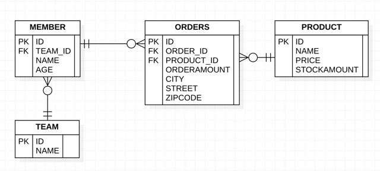

[Git 브런치 바로가기](https://github.com/seop-kim/Java_JPABook/tree/ch10-jpa)

CHAPTER 10
===
[ 객체지향 쿼리 언어 ]
---


과정 요약
---

| 요약         |
|------------|
| JPQL       |
| Criteria   |
| QueryDSL   |
| 네이티브 SQL   |
| 객체지향 쿼리 심화 |

- JPA는 복잡한 검색 조건을 사용하여 엔티티 객체를 조회할 수 있는 다양한 쿼리 기술을 지원한다.  
  `Criteria`나 `QueryDSL`은 `JPQL`을 편리하게 사용하도록 도와주는 기술이며 결과적으로 개발자는 `JPQL`을 필수적으로 알고 있어야 한다.

<br><br>

## 객체지향 쿼리 소개

- `EntityManager.find()` 메소드를 사용하면 식별자로 엔티티 하나를 조회할 수 있다. 조회한 엔티티의 객체 그래프 탐색을 통해 연관된 엔티티를 찾을 수 있다.  
  다만 이 기능만으로는 나이가 30살 이상인 회원을 모두 검색하기는 쉽지 않다. 그렇다고 모든 엔티티를 조회하여 엔티티를 메모리에 올려두고 30살 이상의 사람을 구분하는 것도 좋은 방법이 아니다.  
  데이터는 DB에 저장되어 있으므로 `SQL`을 통하여 필요한 내용을 최대한 걸러 조회를 해야하는데 ORM을 사용하는 입장에서는 테이블이 아닌 엔티티 객체를 대상으로 개발하므로 객체를 조회하는 방법이 필요하다.


- 이러한 문제로 `JPQL`이라는 것이 만들어졌다.
    - 테이블이 아닌 객체를 대상으로 검색하는 객체 지향 쿼리다.
    - SQL을 추상화해서 특성 데이터베이스 `SQL`에 의존하지 않는다.


- `JPQL`을 사용하면 `JPA`는 `JPQL`을 분석하여 적절한 `SQL`을 생성하여 데이터베이스를 조회한다.


- `JPA`는 `JPQL` 뿐만 아니라 다양한 검색 방법을 제공한다.

  | 구분  | 정식 지원 여부 | 내용  |
      |-----|----------|-----|
  |JPQL|정식|-|
  |Criteri|정식|JPQL을 편하게 작성하도록 도와주는 API, 빌더 클래스 모음 더 클래스 모음|
  |Native SQL|정식|Criteria 쿼리처럼 JPQL을 편하게 작성하도록 도와주는 빌더 클래스 모음, 비표준 오픈소스 프레임워크다|
  |JDBC 직접사용, MyBatis 같은 SQL 매퍼 프레임워크 사용|비정식|필요하면 JDBC를 직접 사용할 수 있다.|
  |QueryDSL|비정식|Criteria 쿼리처럼 JPQL을 편하게 작성하도록 도와주는 빌더 클래스 모음, 비표준 오픈소스 프레임워크다|

<br>

### JPQL 소개

- `JPQL`은 엔티티 객체를 조회하는 객체지향 쿼리다.


- `JPQL`은 특정 데이터베이스에 종속되지 않는다. 방언만 변경하면 `JPQL`을 변경하지 않아도 데이터베이스 변경이 가능하다.

#### 예제

  ```java

@Entity(name = "MEMBER")
public class Member {

    @Column(name = "name")
    private String username;
}

// JPQL 생성
public class Main {
    String jpql = "select m from Member m where m.username = 'kim'";
    List<Member> findName = em.createQuery(jpql, Member.class).getResultList();
}
  ```

- 이 예제에서는 `username`이 `kim`인 `Member`를 조회한다.
- `em.createQuery()`은 사용할 `jpql`과 `엔티티객체`를 넘겨주고 조회한 값을 `List`로 변환하기 위해 `getResultList()`로 값을 변환한다.

<br>

### Criteria 소개

- `Criteria`는 `JPQL`을 생성하는 빌더 클래스이다. `criteria`의 장점은 쿼리가 아닌 프로그래밍으로 `JPQL`을 작성할 수 있다.


- `JPQL`은 컴파일 시점에 에러를 잡을 수 없지만 `criteria`는 오류를 잡을 수 있는 것도 장점이다.
    - **다른 장점**
        - IDE를 사용할 경우 코드 자동완성을 지원한다.
        - 동적 쿼리를 작성하기 편하다.


- `JPQL`로 작성했던 이름 조회를 `criteria`로 작성해보자.

#### 예제

  ```java
  public class Main {
    // Criteria  사용 준비
    CriteriaBuilder cb = em.getCriteriaBuilder();
    CriteriaQuery<Member> query = cb.createQuery(Member.class);

    // 루트클래스 (조회를 시작할 클래스)
    Root<Member> m = query.from(Member.class);

    // 쿼리 생성
    CriteriaQuery<Member> cq = query.select(m)
            .where(cb.equal(m.get("username"), "kim"));

    List<Member> members = em.createQuery(cq).getResultList();
}
  ```

- 위 예제를 보면 `username`을 문자로 사용하였다. 만약 이 부분도 코드로 작성을 하고자 하는 경우 `메타모델`을 사용하면 된다. (이건 뒤에서 다시 한번 확인한다)


- `criteria`가 가진 장점은 많지만 이러한 장점들을 상쇄할 정도로 코드가 복잡하고 장황하다. 한 눈에 들어오지도 않는다.

<br>

### QueryDSL 소개

- `QueryDSL`도 `criteria`처럼 `JPQL` 빌더 역할을 한다. `QueryDSL`의 장점은 코드 기반이면서도 단순하고 사용하기 쉽다는 장점이 있다.

#### 예제

  ```java
  import jpabook.chapter10.Member;

public class Main {
    // 준비
    JPAQuery query = new JPAQuery(em);
    QMember member = QMember.member;

    // 쿼리, 결과조회
    List<Member> members = query.from(member)
            .where(member.username.eq("kim"))
            .list(member);
}
  ```

- QueryDSL도 어노테이션 프로세서를 사용해서 쿼리 전용 클래스를 만들어야 한다. `QMember`는 `Member` 엔티티 클래스를 기반으로 생성한 `QueryDSL` 쿼리 전용 클래스이다.

  <br>

### Native SQL 소개

- `Native SQL`은 `SQL`을 직접 사용할 수 있게 해주는 기능이다.

- `JPQL`을 사용하더라도 종종 특정 데이터베이스에 의존하는 기능을 사용해야 할 때가 있다.  
  특정 데이터베이스에만 있는 기능을 사용하는 경우가 이 경우인데 이러한 기능들은 표준화가 되어 있지 않아 `JPQL`에서는 사용할 수 없다.  
  이러한 경우에 `Native SQL`을 사용한다. 다만 특정 데이터베이스에 의존한다는 것이 단점이다.

#### 예제

  ```java
  public class Main {
    String sql = "SELECT ID, AGE, TEAM_ID, NAME FROM MEMBER WHERE NAME = 'kim'";
    List<Member> members = em.createNativeQuery(sql, Member.class).getResultList();
}
  ```

<br>

### JDBC 직접 사용, 마이바티스 같은 SQL 매퍼 프레임워크 사용

- 드문 경우이나 `JDBC` 커넥션에 직접 접근하고자 한다면 JPA는 JDBC 커넥션을 획득하는 API를 제공하지 않으므로 JPA 구현체가 제공하는 방법을 사용하여 JDBC 커넥션을 획득해야 한다.

  ```java
  public class Main {
    public static void main(String[] args) {
      Session session = entityManager.unwrap(Session.class);
      session.dowork(new Work() {
        @Override
        public void execute(Connection connection) throws SQLException{
            // work...
        }
      });
    }
  }
  ```

- 먼저 `EntityManager`에서 하이버네이트 `Session`을 생성하고 `Session`의 `dowork()` 메소드를 호출하면 된다.


- `JDBC`나 `마이바티스`를 `JPA`와 함께 사용한다면 적절한 시점에 영속성 컨텍스트를 강제로 플러시 해야 한다.
    - 이유는 `JDBC`를 직접 사용하든 `마이바티스`를 직접 사용하든 `JPA`를 우회하는 `SQL`에 대해서는 `JPA`는 전혀 인식하지 못한다.  
      만약 영속성 컨텍스트에서 `A`제품의 상품 가격을 `10,000원`에서 `9,000원`으로 수정을 하였는데 `JPA`를 우회하여 `A`제품의 가격을 조회하였다면 `JPA`반영 전 이므로 상품
      가격이 `10,000원`으로 나올 것이다.  
      이러한 이슈를 해결하기 위해 `JPA`를 우회하여 `SQL`을 사용하기 전에 수동으로 플러시를 해야하는 것이다.

<br><br>

## JPQL

- `JPQL`은 객체지향 쿼리 언어다. 따라서 테이블을 대상으로 쿼리하는 것이 아니라 엔티티 객체를 대상으로 쿼리한다.
- `JPQL`은 `SQL`을 추상화해서 특정 데이터베이스 `SQL`에 의존하지 않는다.
- `JPQL`은 결국 `SQL`로 변환된다.

<br>

#### 샘플 모델 UML



<br>

### 기본 문법과 쿼리 API

- `JPQL`도 `SQL`과 비슷하게 `SELECT`, `UPDATE`, `DELETE` 문을 사용할 수 있다.
- 데이터 저장은 `EntityManager.persist()`메소드가 있기에 `INSERT`문은 없다.

<br>

#### SELECT 문

```jpaql
SELECT m FROM Member AS m where m.username = 'Hello'
```

- 대소문자 구분
    - 엔티티와 속성은 대소문자를 구분한다. 위에서 쓴 `Member`, `username`은 대소문자를 구분하고 있다. 반면 `SELECT`, `FROM`, `AS`와 같은 `JPQL` 키워드는 대소문자를
      구분하지 않는다.


- 엔티티 이름
    - `JPQL`에서 사용한 `Member`는 클래스 명이 아니라 엔티티 명이다. 엔티티 명은 `@Entity(name="")`으로 지정할 수 있다. 엔티티 명을 지정하지 않는 경우에는 클래스 명을 기본 값으로
      사용한다.


- 별칭은 필수
    - `Member AS m`을 보면 `Member`에 `m`이라는 별칭을 주었다. `JPQL`은 별칭을 필수로 사용해야 하며 별칭을 사용하지 않는 경우 잘못된 문법이라는 오류가 발생한다.

<br>


> 하이버네이트는 `JPQL` 표준도 지원하지만 더 많은 기능을 가진 `HQL`을 제공한다. `JPA`구현체로 하이버네이트를 사용하면 `HQL`도 사용할 수 있다.


<br>

#### TypeQuery, Query

- `TypeQuery`와 `Query`의 차이점은 반환타입의 객체를 명확하게 지정을 하느냐의 차이이다. 아래 코드를 보자

  ```java
  public class Main {
    public static void main(String[] args) {
      TypedQuery<Member> typedQuery = em.createQuery("select m from Member m", Member.class);
      for (Member member : typedQuery.getResultList()){
        System.out.println("Member : " + member);
      }
  
      Query query = em.createQuery("select m.username, m.age from Member m");
      for (Object o : query.getResultList()){
          Object[] result = (Object[]) o;
        System.out.println("username : " + result[0]);
        System.out.println("age : " + result[1]);
      }
    }
  }
  ```

- `TypeQuery`은 `createQuery()`의 두번째 파라미터에 반환받을 타입의 객체를 넣어줘야 한다.


- `Query`은 위 코드에서 보면 `String`인 `username`과 `Integer`인 `age`와 같이 대상 타입이 명확하지 않은 경우 사용할 수 있겠다.
    - `Query`의 경우 조회 대상이 위 예제와 같이 다수일 경우 `Object[]`의 배열 타입으로 반환을 한다.


- 결과를 조회함에 있어 아래와 같은 메소드를 통해 결과 값을 사용할 수 있는 객체로 반환 받을 수 있다.
    - `Query.getResultList()` : 결과를 예제로 반환한다. 만약 결과가 없으면 빈 컬렉션이 반환된다.
    - `Query.getSingleResult()` : 결과가 정확히 하나일 때 사용한다.
        - 결과가 없으면 `NoResultException` 예외가 발생한다.
        - 결과가 1개보다 많으면 `NonUniqueResultException` 예외가 발생한다.

<br><br>

### 파라미터 바인딩

- `JDBC`는 위치 기준 파라미터 바인딩만 지원을 하지만 `JPQL`은 이름 기준 파라미터 바인딩을 지원한다.

<br>

#### 위치 기준 파라미터 바인딩 예제

```java
public class Main {
    public static void main(String[] args) {
        String usernameParam = "kim";
        List<Member> members =
                em.createQuery("SELECT m from Member m where m.username = ?1", Member.class)
                        .setParameter(1, usernameParam)
                        .getResultList();
    }
}
```

- 위치 기반의 파라미터 바인딩은 쿼리의 좌측부터 `?`의 부분에 값을 바인딩 하는 것이다. `1,2,3...` 과 같이 순서가 진행된다.

<br>

#### 이름 기준 파라미터 바인딩 예제

```java
import jpabook.chapter10.Member;

public class Main {
    public static void main(String[] args) {
        String usernameParam = "kim";
        List<Member> members =
                em.createQuery("select m from Member m where m.username = :username", Member.class)
                        .setParameter("username", usernameParam)
                        .getResultList();
    }
}
```

- 쿼리의 파라미터에 바인딩을 이름으로 구분할 수 있어 순서에 신경쓰지 않아도 된다.

<br><br>

### 프로젝션

- `SELECT` 절에 조회할 대상을 지정하는 것을 프로젝션이라고 한다.


- 프로젝션 대상은 `엔티티`, `임베디드 타입`, `스칼라 타입`이 있다.
    - 스칼라 타입 : 숫자, 문자 등 기본 타입을 칭함

<br>

#### 엔티티 프로젝션

```jpaql
SELECT m FROM Member m
SELECT m.team FROM Member m
```

- 위 코드 모두 엔티티를 프로젝션 대상으로 사용했다.
- 엔티티를 대상으로 조회를 한 데이터는 영속성 컨텍스트에서 관리된다.

<br>

#### 임베디드 타입 프로젝션

- `JPQL`에서 임베디드 타입은 엔티티와 거의 비슷하게 사용된다.
- 임베디드 타입은 조회의 시작점이 될 수 없다.

```java
public class Main {
    public static void main(String[] args) {
        // 에러
        String queryError = "SELECT a FROM Address a"; // 임베디드 타입인 Address는 조회의 시작점이 될 수 없다.

        // 정상
        String query = "SELECT o.address FROM Order o";
        List<Address> addresses = em.createQuery(query, Address.class);
    }
}
```

- 임베디드 타입은 엔티티타입이 아닌 값 타입으로 직접 조회할 경우 영속성 컨텍스트에서 관리되지 않는다.

<br>

#### 스칼라 타입 프로젝션

- 숫자, 문자, 날짜와 같은 기본 데이터 타입을 스칼라 타입이라고 한다.
- 아래는 전체 회원의 이름을 조회하기 위한 코드이다.

```java
public class Main {
    public static void main(String[] args) {
        List<String> usernames =
                em.createQuery("SELECT m.username FROM Member m", Member.class)
                        .getResultList();

        // 중복 제거를 위한 코드
        usernames =
                em.createQuery("SELECT DISTINCT m.username FROM Member m", Member.class)
                        .getResultList();

        // 통계 쿼리 또한 스칼라 타입으로 조회한다.
        Double orderAmountAvg =
                em.createQuery("SELECT AVG(o.orderAmount) FROM Order o", Double.class)
                        .getResultList();
    }
}
```

<br>

#### 여러 값 조회

- 엔티티를 대상으로 조회하면 편하지만 특정 데이터만 필요로 인해 조회를 해야하는 경우가 있다.  
  프로젝션에서 여러 값을 선택하여 `Query` 를 사용하면 조회를 할 수 있다.

  ```java
  public class Main{
    Query query =
            em.createQuery("SELECT m.username, m.age FROM Member m");
    List resultList = query.getResultList();
  
    Iterator iterator = resultList.iterator();
    while(iterator.hasNext()){
          Object[] row = (Object[]) iterator.next();
      String username = (String) row[0];
      Integer age = (Integer) row[1];
    }
    
    // 제네릭 사용 시 간소화 가능
  
    List<Object[]> resultList = em.createQuery("SELECT m.username, m.age FROM Member m").getResultList();
        
    for (Object[] row : resultList){
      String username = (String) row[0];
      Integer age = (Integer) row[1];
    }
  }
  ```

- 스칼렛 타입 뿐만이 아닌 엔티티 타입도 여러 값을 함께 조회할 수 있다.

<br>

#### NEW 명령어

- 위에서 진행한 예제에서는 `username`과 `age` 두 필드를 프로젝션해서 타입을 지정할 수 없어 `Query`를 통해 `Object[]`를 반환 받았다.  
  실제로는 `Object` 객체를 직접 사용하는 것이 아닌 `DTO` 클래스를 통해 의미 있는 객체로 변환해서 사용한다.

```java
import java.util.ArrayList;
import javax.persistence.TypedQuery;

public class UserDTO {
    private String username;
    private Integer age;

    public UserDTO(String username, int age) {
        this.username = username;
        this.age = age;
    }
}


public class Main {
    List<Object[]> resultList =
            em.createQuery("SELECT m.username, m.age FROM Member m")
                    .getResultList();

    // 객체 변환 작업
    List<UserDTO> userDTOs = new ArrayList<>();
  for(
    Object[] objects :resultList)

    {
        UserDTO user = new UserDTO(objects[0], objects[1]);
        userDTOs.add(user);
    }

    // 간소화
    TypedQuery<UserDTO> dtoQuery =
            em.createQuery("SELECT new {클래스경로입력}.UserDTO(m.username, m.age) FRIN Nenber m", Member.class);
    List<UserDTO> result = dtoQuery.getResultList();
}
``` 

- 간소화 코드를 보면 `SQL`문에서 `new UserDTO`를 사용하였다. `new`명령어를 사용하면 반환받을 클래스를 지정할 수 있어 `TypedQuery`를 사용할 수 있게 된다.
    - `new` 명령어를 사용할 때에는 아래의 규칙을 준수해야 한다.
        - 패키지 명을 포함한 전체 클래스명을 입력해야 한다.
        - 순서와 타입이 일치하는 생성자가 필요하다

<br><br>

### 페이징 API

- 페이징 처리용 `SQL`을 작성하는 일은 지루하고 반복적이다. 더욱이 문제점은 데이터베이스마다 페이징을 처리하는 `SQL` 문법이 다른점이다.
- `JPA`는 페이징 처리를 다음의 2개의 API로 추상화 하였다.
    - `setFirstResult(int startPosition)` : 조회 시작 위치 (0부터 시작한다)
    - `setMaxResults(int maxResult)` : 조회할 데이터 수

<br>

#### 예제

```java
public class Main {
    public static void main(String[] args) {
        TypedQuery<Member> query =
                em.createQuery("SELECT m FROM Member m ORDER BY m.username DESC", Member.class);
        query.setFirstResult(10);
        query.setMaxResults(20);
        query.getResultList();
    }
}
```

- 예제를 보면 `query.setFirstResult(10)`은 시작이 10이므로 11번째부터 시작해서 `query.setMaxResults(20)`의 조건을 통해 총 20건의 데이터를 조회하므로 11~30번의
  데이터를 조회한다.
- DB 마다 다른 페이징 처리를 같은 API로 처리할 수 있는 것은 DB 방언 덕분이다. `JPQL`이 방언에 따라 그에 맞는 `SQL`로 변환을 해주기 때문. 다만 페이징 `SQL`을 더 최적화 하고자
  한다면 `네이티브SQL`을 직접 사용해야 한다.

<br><br>

### 집합과 정렬

- 집합은 집합함수와 함께 통계 정보를 구할 떄 사용한다. 아래의 코드는 `회원수`, `나이 합`, `평균 나이`, `최대 나이`, `최소 나이`를 조회한다.
  ```jpaql
  select
      COUNT(m),
      SUM(m.age),
      AVG(m.age),
      MAX(m.age),
      MIN(m.age)
  from Member m
  ```

#### 집합함수

| 함수       | 설명                                                                                                                    |
|----------|-----------------------------------------------------------------------------------------------------------------------|
| COUNT    | 결과 수를 구한다. 반환타입 : `Long`                                                                                              |
| MAX, MIN | 최대, 최소 값을 구한다. 문자, 숫자, 날짜 등에 사용한다.                                                                                    |
| AVG      | 평균 값을 구한다. 숫자 타입만 사용할 수 있다. 반환타입 : `Double`                                                                           |
| SUM      | 합을 구한다. 숫자 타입만 사용할 수 있다. 반환 타입 : 정수합 `Long`, 소수합 : `Double`, BigInteger 합 : `BigInteger`, BigDecimal 합 : `BigDecimal` |

<br>

#### 집합 함수 사용 시 참고사항

- `NULL` 값은 무시하므로 통계에 잡히지 않는다. (`DISTINCT`가 정의되어 있어도 무시된다.)
- 값이 없을 때 `SUM`, `AVG`, `MAX`, `MIN`을 사용하면 `NULL`값이 되고 `COUNT`는 `0`이 된다.
- `DISTINCT`를 집합 함수 안에 사용해서 중복된 값을 제거하고 나서 집합을 구할 수 있다.
- `DISTINCT`를 `COUNT`에서 사용할 때 임베디드 타입은 지원하지 않는다.

<br>

#### GROUP BY, HAVING

- `GROUP BY`는 통계 데이터를 구할 때 특정 그룹끼리 묶어준다. 아래 코드는 팀 이름을 기준으로 그룹을 묶어 통계 데이터를 구한다.

  ```jpaql
  select t.name, COUNT(m.age), SUM(m.age), AVG(m.age), MAX(m.age), MIN(m.age)
  from Member m LEFT JOIN m.team t
  GROUP BY t.name
  ```

<br>

- `HAVING`은 `GROUP BY`와 함께 사용하는데 `GROUP BY`로 그룹화한 데이터를 기준으로 필터링을 하는 것이다.  
  아래 코드는 `GROUP BY`로 구한 통계 데이터에서 평균 나이가 10살 이상인 그룹을 조회한다.

  ```jpaql
  select t.name, COUNT(m.age), SUM(m.age), AVG(m.age), MAX(m.age), MIN(m.age)
  from Member m LEFT JOIN m.team t
  GROUP BY t.name
  HAVING AVG(m.age) >= 10
  ```

<br>

- 이러한 쿼리들을 `리포팅 쿼리` 혹은 `통계 쿼리`라고 한다. 통계 쿼리를 잘 활용하면 애플리케이션에서 사용할 코드보다 적은 코드로 처리를 할 수 있으나  
  통계쿼리는 보통 전체 데이터를 기준으로 처리하므로 실시간으로 사용하기엔 부담이 많다.
    - 만약 결과가 너무 많다고 한다면 통계 결과만 저장하는 테이블을 별도로 생성하여 사용자가 적은 새벽에 통계 쿼리를 실행하여 결과를 보관해 두는 것이 좋다.

<br>

#### 정렬 (ORDER BY)

- `ORDER BY`는 결과를 정렬할 때 사용한다. 아래의 코드는 나이를 기준으로 내림차순으로 정렬하고 나이가 같을 경우 오름차순으로 정렬한다.

  ```jpaql
  select m from Member m order by m.age DESC, m.username ASC 
  ```

<br>

#### JPQL 조인

- `JPQL`은 조인을 지원한다. `SQL`과 기능은 같으나 문법이 조금 다르다.

  #### 내부 조인
    - 내부 조인은 `INNER JOIN`을 사용한다. (INNER JOIN은 생략이 가능하다.)
  ```java
  public class App{
      public static void main(String[] args){
        String teamName = "팀A";
        String query = "SELECT m FROM Member m INNER JOIN m.team t WHERE t.name = :teamName";
        List<Member> members = em.createQuery(query, Member.class)
                .setParameter("teamName", teamName)
                .getResultList();
      }
  }
  ```
  
<br>

  - 회원과 팀을 내부 조인해서 '팀A'에 소속된 회원을 조회하는 다음 JPQL을 보자

    ```jpaql
    SELECT m
    FROM Member m INNER JOIN m.team t
    WHERE t.name = :teamName
    
    SELECT 
        M.ID AS ID,
        M.AGE AS AGE,
        M.TEAM_ID AS TEAM_ID,
        M.NAME AS NAME
    FROM
        MEMBER M INNER JOIN TEAM T ON M.TEAM_ID = T.ID
    WHERE 
        T.NAME = ?
    ```
    - `JPQL` 내부 조인 구문을 보면 `SQL`의 조인과 약간 다른 것을 확인할 수 있다.  
      `JPQL` 조인의 가장 큰 특징은 연관 필드를 사용한다는 것인데 위 코드에서 보면 `m.team t` 부분을 보면 된다.

      - `FROM Member m` : 회원을 선택하고 m 이라는 별칭을 주었다.
      - `Member m JOIN m.tesm t` : 회원이 가지고 있는 연관 필드로 팀과 조인한다. 조인한 팀에는 t라는 별칭을 주었다.

      - `JPQL`을 `SQL` 조인처럼 사용하면 문법의 오류가 발생한다. `JPQL`은 `JOIN` 명령어 다음에 조인할 객체의 연관 필드를 사용한다. 아래의 코드는 잘못된 예이다.
      ```jpaql
      FROM Member m JOIN Team t
      ```

<br>

  ```jpaql
  SELECT m.username, t.name
  FROM Member m JOIN m.team t
  WHERE t.name = '팀A'
  ORDER BY m.age DESC
  ```
  - 위 쿼리는 `팀A`에 속한 회원을 나이 내림차순으로 조회를 하여 이름과 팀명을 조회한다.

  - 만약 조인한 두개의 엔티티를 조회하려면 아래와 같이 `JPQL`을 작성하면 된다.
    ```jpaql
    SELECT m,t
    FROM Member m JOIN m.team t 
    ```
  
    - 서로 다른 타입의 두 엔티티를 조회하였으므로 `TypeQuery`를 사용할 수 없다. `Object[]`를 사용하여 조회해야한다.
    ```java
    public class App{
      public static void main(String[] args) {
        List<Object[]> result = em.createQuery(query).getResultList();
        for (Object[] row : result){
          Member member = (Member) row[0];
          Team team = (Team) row[1];
        }
      }
    }
    ```

<br>

  #### 외부 조인
  - `JPQL`의 외부 조인은 아래와 같이 사용하며 `[OUTER]`는 생략이 가능하여 보통은 `LEFT JOIN`으로 많이 사용한다.
  ```jpaql
  SELECT m
  FROM Member m LEFT [OUTER] JOIN m.team t
  
  SELECT m
  FROM Member m LEFT JOIN m.team t
  
  SELECT 
    M.ID AS ID,
    M.AGE AS AGE,
    M.TEAM_ID AS TEAM_ID,
    M.NAME AS NAME
  FROM
    MEMBER M LEFT OUTER JOIN TEAM T ON M.TEAM_ID = T.ID
  WHERE
    T.NAME = ?
  ```

<br>
  
  #### 컬렉션 조인
  - 일대다 관계나 다대다 관계처럼 컬렉션을 사용하는 곳에 조인하는 것을 컬렉션 조인이라고 한다.
    - **[회원 -> 팀]** 으로의 조인은 다대일 조인이면서 단일 값 연관 필드`m.team`를 사용한다.
    - **[팀 -> 회원]** 은 반대로 일대다 조인이면서 컬렉션 값 연관 필드`m.members`를 사용한다.
  
  ```jpaql
  SELECT t, m FROM Team t LEFT JOIN t.members m
  ```

  <br>

  #### 세타조인
  - `WHERE` 절을 사용하여 세타 조인을 할 수 있다. 세타 조인은 내부 조인만을 지원한다.
  - 아래 예제는 회원이름이 팀이름과 같은 사람의 수를 구하는 예제이다.
    ```jpaql
    select count(m) from Member m, Team t
    where m.username = t.name
    
    SELECT COUNT(M.ID)
    FROM
        MEMBER M CROSS JOIN TEAM T
    WHERE
        M.USERNAME = T.NAME
    ```
    
  <br>

  #### JOIN ON 절 (JPA2.1)
  - `JPA 2.1`부터는 조인에서 `ON`을 지원한다. `ON`을 사용하면 조인 대상을 필터링하고 조인할 수 있다.
  - 내부조인의 `ON`은 `WHERE`를 사용할 떄와 결과가 같으므로 `ON`은 보통에 외부 조인에서만 사용한다.
  - 모든 회원을 조회하면서 회원과 연관된 팀을 조회하고 이때 팀 이름이 `A`인 팀만 조회를 한다.
    ```jpaql
    select m, t from member m
    left join m.team t on t.name = 'A'
    
    SELECT m.*, t.* FROM Member m
    LEFT JOIN TEAM t ON m.TEAM_ID = t.id and t.name = 'A'
    ```
<br>

### 페치조인
- `SQL`에서 이야기하는 조인의 종류는 아니고 `JPQL`에서 성능 최적화를 위해 제공하는 기능이다.
- 연관된 엔티티 컬렉션을 한번에 같이 조회하는 기능이며 `join fetch` 명령어로 사용할 수 있다.
 
#### 엔티티 페치 조인
- 아래는 페치 조인을 사용하여 회원 엔티티를 조회하면서 연관된 팀 엔티티도 함께 조회하는 `JPQL`이다.
  ```jpaql
  select m
  from Member m join fetch m.team
  
  SELECT
    M.*, T.*
  FROM MEMBER M
  INNER JOIN TEAM T OM M.TEAM_ID = T.ID
  ```
  
  - 위 예제에서 `join` 다음에 `fetch`라 적혀있다 이는 연관된 엔티티나 컬렉션을 함께 조회하는데 여기서는 회원과 팀을 함께 조회한다.  
  `JPQL`의 조인과는 다르게 `m.team` 다음에 별칭이 없는데 페치조인에서는 별칭을 사용할 수 없기 때문이다.
    - 하이버네이트에서는 페치조인도 별칭을 사용할 수 있다.

  
  - 위 예제에서 실행되는 `SQL`을 보면 `JPQL`에서는 분명 `MEMBER` 엔티티인 `m`만 조회를 하였는데 `SQL`에서는 `MEMBER`와 `TEAM` 엔티티를 모두 조회를 하는 것을 볼 수 있다.

    ```java
    public class App{
      public static void main(String[] args) {
        String jpql = "select m from Member m join fetch m.team";
    
        List<Member> members = em.createQuery(jpql, Member.class).getResultList();
    
        for (Member member : members) {
          System.out.println("username : " + member.getUsername() + " teamname : " + member.getTeam().name());
        }
      }
    }
    ```
    - 회원과 팀을 지연로딩 했다고 가정을 해보자, 회원 조회를 하며 페치 조인을 사용하여 팀을 조회했기 때문에 팀 엔티티는 프록시가 아닌 실체 엔티티이다.  
    연관된 팀을 사용해도 지연 로딩이 발생하지 않고 회원 엔티티가 영속성 컨텍스트에서 분리되어 준영속 상태가 되어도 연관된 팀을 조회할 수 있다.

<br>

#### 컬렉션 페치 조인
- 이번에는 일대다 관계인 컬렉션을 페치 조인 해보자.
  ```jpaql
  select t
  from Team t join t.members
  where t.name = "팀A"
  
  
  SELECT T.*, M.*
  FROM TEAM T
  INNER JOIN MEMBER M ON T.ID = M.TEAM_ID
  WHERE T.NAME = "팀A"
  ```

- 일대다 조인의 특성 상 하나의 `Team`에는 여러명의 `Member`가 있을 수 있다. 그렇기에 `Team`의 수보다 많은 데이터가 조회가 될 수 있다.
  - 일대다 조인은 결과 수가 증가할 수 있지만 다대일은 결과가 증가하지 않는다.

  ```java
  import jpabook.chapter10.Team;
  
  public class App {
    public static void main(String[] args) {
      String jpql = "select t from Team t join fetch t.members where t.name = '팀A'";
      List<Team> teams = em.createQuery(jpql, Team.class);
  
      for (Team team : teams) {
        System.out.println("teamName : " + team.getName() + " team : " + team);
  
        for (Member member : team.getMembers()) {
          System.out.println("-> member = " + member);
        }
      }
    }
  }
  ```
  
  <br>
  
  #### 결과
  ```
  teamName : 팀A, Team : Team@0x100
  -> username : 회원1......
  -> username : 회원2......
  
  teamName : 팀A, Team : Team@0x100
  -> username : 회원1......
  -> username : 회원2......
  ```
  

<br>

#### 페치 조인과 DISTINCT
- `DISTINCT`는 `SQL`에서 중복 결과를 제거하는 명령어이다. `JPQL`에서는 한 가지 기능이 더 추가되는 그것은 애플리케이션에서 한 번 더 중복을 제거하는 것이다.
- 바로 직전에 한 예제인 컬렉션 페치 조인은 `팀A`가 중복되어 조회된다. `DISTINCT`를 사용하여 `JPQL`로 조회를 하면 `팀A`가 중복이 제거되고 출력된다.

  ```java
  import jpabook.chapter10.Team;
  
  public class App {
    public static void main(String[] args) {
      String jpql = "select distinct t from Team t join fetch t.members where t.name = '팀A'";
      List<Team> teams = em.createQuery(jpql, Team.class);
  
      for (Team team : teams) {
        System.out.println("teamName : " + team.getName() + " team : " + team);
  
        for (Member member : team.getMembers()) {
          System.out.println("-> member = " + member);
        }
      }
    }
  }
  ```

  <br>

  #### 결과
  ```
  teamName : 팀A, Team : Team@0x100
  -> username : 회원1......
  -> username : 회원2......
  ```
  
<br><br>

### 페치 조인과 일반 조인의 차이 
- 만약 페치 조인을 하지 않고 조인만 사용한다면 팀 엔티티는 조회가 되나 회원 엔티티가 조회되지 않을 것이다. (즉시로딩을 설정하면 같이 불러오기는 하지만 `Query`가 2번 실행된다.)
- 페치 조인을 하게 되면 `SQL`이 한번만 실행된다.

<br>

#### 페치 조인의 특징과 한계
- 페치 조인은 사용하면 하나의 sql로 연관된 엔티티를 함께 조회할 수 있어 성능을 최적화 시킬 수 있다.
- 페치 조인은 글로벌 로딩 전략보다 우선하여 적용된다.
- 페치 조인은 대상에게 별칭이 부여가 불가능하여 `select` 나 `where` 절 서브쿼리에 페치조인 대상으로 사용할 수 없다.
  - JPA 표준에서 지원을 하지 않는 것이지 하이버네이트 및 몇몇 구현체에서는 조인 대상에 별칭을 지원을 한다. 다만 별칭을 잘 못 사용하는 경우 데이터의 무결성 원칙이 깨질 수 있는 점은 참고하자.

- 둘 이상의 컬렉션에는 페치를 사용할 수 없다. 되는 경우가 있지만 컬렉션 * 컬렉션의 경우 카테시안 곱이 만들어 질 수 있으므로 주의해야 한다.
- 컬렉션을 페치조인할 경우 `페이징API`를 사용할 수 없다.

<br><br>

### 경로 표현식
- `jpql`에서 사용하는 경로표현식을 통해 묵시적조인을 할 수 있다.

    ```jpaql
    select m.username
    from Member m
        join m.team
        join m.orders o
    where t.name = '팀A'
    ```
- 위 코드에서 `.`으로 사용하는 `m.username`과 같은 것들이 모두 경로 표현식을 사용한 예시이다.  

<br>

#### 경로 표현식의 용어 정리
- 경로 표현식을 이해하려면 아래의 용어들을 알아야 한다.
  - 상태필드 : 단순히 값을 저장하기 위한 필드
  - 연관필드 : 연관관계를 위한 필드, 임베디드 타입 포함
    - 단일 값 연관 필드 : `ManyToOne`, `OneToOne` 대상이 엔티티이다.
    - 컬렉션 값 연관 필드 : `OneToMany`, `ManyToMany` 대상이 컬렉션이다.

    ```java
    @Entity
    public class Member {
        @Id
        @GeneratedValue
        private Long id;
    
        @Column(name = "name")
        private String username; // 상태필드
        private Integer age; // 상태필드
    
        @ManyToOne(..)
        private Team team; // 연관필드 (단일 값 연관 필드)
    
        @OneToMany(..)
        private List<Order> orders; // 연관필드 (컬렉션 값 연관 필드)
    }
    ```
    
<br>

#### 경로 표현식과 특징
- `jpql`에서 경로 표현식을 사용해서 경로 탐색을 하려면 3가지 경로에 따라 어떠한 특징이 있는지 알아야한다.

    | 구분          | 특징                                                                      |
    |-------------|-------------------------------------------------------------------------|
    | 상태 필드 경로    | 경로 탐색의 끝이다. 더는 탐색할 수 없다                                                 |
    | 단일 값 연관 경로  | 묵시적으로 내부 조인이 일어난다. 단일 값 연관 경로는 계속 탐색할 수 있다.                             |
    | 컬렉션 값 연관 경로 | 묵시적으로 내부 조인이 일어난다. 더는 탐색할 수 없다. 단 FROM 절에서 조인을 통해 별칭을 얻으면 별칭으로 탐색할 수 있다. |


##### 상태 필드 경로 탐색
- 다음 `JPQL`의 `m.username`, `m.age`는 상태 필드 경로 탐색이다.
    ```jpaql
    select m.username, m.age from Member m
    ```

- 상태 필드 경로 탐색은 이해하는 데 어려움이 없다.

<br>

##### 단일 값 연관 경로 탐색
```jpaql
select o.member from Order o
```

- `jpql`을 보면 `o.member`를 통해 주문에서 회원으로 단일 값 연관 필드로 경로 탐색을 했다.  
단일 값 연관 필드로 경로 탐색을 하면 `SQL`에서 내부 조인이 일어나는데 이를 `묵시적 조인`이라고 한다. 추가로 묵시적 조인은 모두 내부 조인이다.

  <br>

  - 명시적 조인 : JOIN을 직접 적어주는 것 `ex) SELECT m FROM Member m JOIN m.team t`
  - 묵시적 조인 : 경로 표현식에 의해 묵시적으로 조인이 일어나는 것, 내부 조인만 할 수 있다.

<br>

  -  예제
      ```jpaql
      select o.member.team
      from Order o
      where o.product.name = 'productA' and o.address.city = 'JINJU'
      ```
        실행 SQL
        ```jpaql
        select t.*
        from Order o
        inner join Member m on o.member_id=m.id
        inner join Team t on m.team_id=t.id
        inner join product p on o.product_id=p.id
        where p.name='productA' and o.city='JINJU'
        ```

- 실행 `SQL`을 보면 총 3번의 조인이 발생한다.  
참고로 `o.address`처럼 임베디드 타입에 접근하는 것도 단일 값 연관 경로 탐색이지만 주문 테이블에 이미 포함되어 있으므로 조인이 발생하지 않는다.

  
<br>

##### 컬렉션 값 연관 경로 탐색
- `JPQL`을 다루면서 많이 하는 실수 중 하나는 컬렉션 값에서 경로 탐색을 시도하는 것이다.
```jpaql
select t.members from Team t 
select t.members.username from Team t 
```

- `t.members`처럼 컬렉션까지는 경로 탐색이 가능하다.   
다만 `t.members.username`처럼 컬렉션에서 경로 탐색을 시작하는 것은 허락하지 않는다.  
만약 컬렉션에서 경로 탐색을 하고 싶으면 다음 코드처럼 조인을 사용하여 별칭을 획득해야 한다.

    ```jpaql
    select t.username from Team t join t.members m
    ```

<br>

- `join t.members m`으로 컬렉션에 새로운 별칭을 얻었다. 이제 별칭 `m`부터 다시 경로 탐색을 할 수 있다.  
추가로 컬렉션은 컬렉션의 크기를 구할 수 있는 `size`라는 기능이 있다. `size`를 사용하면 `count` 함수를 사용하는 `SQL`로 적절히 변환된다.

```jpaql
select t.members.size from Team t
```

<br>

#### 경로 탐색을 사용한 묵시적 조인 시 주의사항
- 경로 탐색을 사용하면 묵시적 조인이 발생하여 `SQL`에서 내부 조인이 일어날 수 있다.
  - 항상 내부 조인이다.
  - 컬렉션은 경로 탐색의 끝이다. 컬렉션에서 경로 탐색을 하려면 명시적으로 조인해서 별칭을 얻어야 한다.
  - 경로 탐색은 주로 `SELECT`, `WHERE` 절에서 사용하지만 묵시적 조인으로 인해 `SQL`의 `FROM`절에 영향을 준다.


- 조인이 성능상 차지하는 부분이 크다 묵시적 조인은 조인이 발생하는 상황을 파악하기 어려운 단점이 있어 성능이 중요한 경우 분석을 할 수 있도록 명시적 조인을 사용하는게 좋다.

<br><br>

### 서브쿼리
- `JPQL`도 `SQL`과 같이 서브 쿼리를 지원한다.   
다만 몇 가지 에약이 있는데 서브쿼리는 `WHERE`와 `HAVING` 절에서만 사용이 가능하고 `SELECT`, `FROM`절에서는 사용할 수 없다.


#### 서브 쿼리 함수
- [NOT] EXISTS (subquery)
  - 서브쿼리에 결과가 존재하면 참이다.
  

- {ALL | ANY | SOME} (subquery)
  - 비교 연산자와 같이 사용된다. 
  - ALL : AND
  - ANY | SOME : OR


- [NOT] IN (subquery)
  - 서브쿼리 결과 중 하나라도 같은 것이 있으면 참이다.


<br><br>

### 조건식
#### 타입표현
| 종류      | 설명                                                              | 예제            |
|---------|-----------------------------------------------------------------|---------------|
| 문자      | 작은 따옴표 사이에 표현                                                   | 'HELLO'       |
| 숫자      | L (Long), D(Double), F(Float)                                   | 10L, 10D, 100F|
| 날짜      | DATE{d 'yyyy-mm-dd'}, TIME{t 'hh-mm-ss'}, DATETIME : 왼쪽 두개 합친 것 |               |
| Boolean | 참, 거짓                                                           |               |
| Enum    | 패키지 명을 포함한 전체 이름을 사용해야 한다.                                      |               |
| 엔티티타입   | 상속과 관련해 사용                                                      |               |

<br>

#### 연산자 우선 순위
- 경로 탐색 연산 : `.`
- 수학 연산 : `+`, `-`, `*`, `/`, `+`, `-` 등
- 비교 연산 : `=`, `>` `<>`(다름), `BETWEEN` 등 
- 논리 연산 : `NOT`, `AND`, `OR`

<br>

#### 논리 연산과 비교식
##### 논리 연산
- AND : 둘 다 참이여야 참
- OR : 둘 중 하나만 참이여도 참
- NOT : 반대


#### Between
- 문법 : `x BETWEEN A AND B`
  - x 가 A와 B의 사이 값이면 참

#### IN
- 문법 : `x IN (예제)`
  - x와 같은 값이 예제에 하나라도 있으면 참이다.


#### LIKE
- 문법 : `LIKE (패턴값) [ESCAPE 문자]` 
  - 문자 표현식과 패턴 값을 분석한다.
  - % : 아무 값들이 입력 되어도 됨
  - _ : 한글자는 아무 값이 입력되어도 값이 있어야 한다.

#### NULL 비교식
- 문법 : `{단일 값 경로} IS NULL`
  - `NULL`인지 비교한다 NULL은 `=`로는 비교가 되지 않는다. 

<br>


### 컬렉션 식
- 컬렉션 식은 컬렉션에서만 사용한다. 또한 컬렉션은 컬렉션식만 사용이 가능하다는 점은 기억해두자.

#### 빈 컬렉션 비교 식
- 문법 : `컬렉션 값 연관 경로 IS [NOT] EMPTY`
  - 값이 비어있으면 참을 반환한다.

#### 컬렉션의 멤버 식
- 문법 : `{엔티티나 값} [NOT] MEMBER [OF] {컬렉션 값 연관 경로}`
- 엔티티나 값이 컬렉션에 포함되어 있으면 참을 반환한다.

<br>

### 스칼라 식
- 스칼라는 숫자, 문자, 날짜, case, 엔티티타입 같은 가장 기본적인 타입들이다. 스칼라는 아래의 식을 사용한다.

<br>

#### 수학식
- `+, -` : 단항 연산자
- `*,/,+,-` : 사칙연산

<br>

#### 문자함수
- `CONCAT`, `SUBSTRING`, `TRIM`, `LOWER`, `UPPER`, `LENGTH`, `LOCATE`

<br>

#### 수학함수
- `ABS` : 절대 값 반환
- `SQRT` : 제곱근 반환
- `MOD` : 나머지 반환
- `SIZE` : 컬렉션 크기 반환
- `INDEX` : LIST 타입 컬렉션의 위치 값 반환

<br>

#### 날짜함수
- 날짜 함수는 데이터 베이스의 현재 시간을 조회한다.
- `CURRENT_DATE` : 현재 날짜
- `CURRENT_TIME` : 현재 시간
- `CURRENT_TIMESTAMP` : 현재 날짜 시간

<br>

#### CASE 식
- 특정 조건에 따라 분기할 때 사용한다. 케이스 식은 총 4가지가 있다.
  - 기본 CASE
  - 심플 CASE : 조건식 사용이 불가하지만 문법이 단순하다.
  - COALESCE : 스칼라식을 차례대로 조회해서 null이 아니면 반환한다.
  - NULLIF : 두 값이 같으면 Null을 반환하고 다르면 첫번째 값을 반환한다. 집합함수와 함께 많이 사용한다.

<br>

### 다형성 쿼리
- JPQL로 부모 엔티티를 조회하면 그 자식 엔티티도 같이 조회한다.

```Java
@Entity
@Inheritance(strategy = InheritanceType.SINGLE_TABLE)
@DiscriminatorColumn(name = "DTYPE")
public abstract class Item {...
}

@Entity
@DiscriminatorValue("B")
public class Book extends Item{
    ...
    private String author;
}
// Album, Movie 생략
```

다음과 같이 조회하면 Item의 자식도 함께 조회된다.

```java
List resultList = em.createQuery("select i from Item i").getResultList();
```

단일 테이블 전략을 사용할 때 실행되는 SQL은 다음과 같다.
```jpaql
SELECT * FROM ITEM
```

<br>

조인 전략을 사용할 때 실행되는 SQL은 다음과 같다.
```jpaql
SELECT
    i.ITEM_ID, i.DTYPE, i.name, i.price, i.stockQuantity,
    b.author, b.isbn,
    a.artist, a.etc,
    m.actor, m.director
FROM
    Item i
left outer join
    Book b on i.ITEM_ID=b.ITEM_ID
left outer join
    Album a on i.ITEM_ID=a.ITEM_ID
left outer join
    Movie m on i.ITEM_ID=m.ITEM_ID
```

<br><br>

### TYPE
- `TYPE`는 엔티티의 상속 구조에서 조회 대상을 특정 자식 타입으로 한정할 때 주로 사용한다.
- ex) `Item` 중에서 `Book`, `Movie` 만 조회하라
    ```jpaql
    select i from Item i
    where type(i) IN (Book, Movie)
    ```

<br><br>

### TREAT(JPA2.1)
- JPA 2.1에서 추가된 기능이다. 자바의 타입 캐스팅과 비슷하고 상속 구조에서 부모 타입을 특정 자식 타입으로 다룰 때 사용한다.
- JPA 표준에서는 `FROM`과 `WHERE`절에서 사용 가능하며, 하이버네이트에서는 `SELECT`절에서도 사용이 가능한다.

    ```jpaql
    select i from Item i where treat(i as Book).author = 'kim'
    ```

<br><br>

`
<![CDATA[]> 는  Character Data 의 약자이며 이 구문 안에 포함되어 있는 데이터는 파싱이 되지 않도록 한다.
정규 XML 태그로 취급되는 문자들에 대해 이스케이프 처리가 가능한 것이다.
`


Spring Data JPA는 Java 언어를 사용하여 데이터 액세스 계층을 관리하기 위한 프레임워크입니다. Spring Data JPA를 사용하면 Java 개발자는 SQL 쿼리 작성 및 데이터 액세스를 처리하는 작업을 쉽게 수행할 수 있습니다. 이를 위해 Spring Data JPA는 개발자가 쉽게 CRUD (Create, Read, Update, Delete) 레파지토리 인터페이스를 작성할 수 있도록 자동화된 기능을 제공합니다.

Spring Data JPA에서는 SQL 쿼리를 작성하는 방법으로 XML 파일을 사용할 수 있습니다. 이렇게 XML 파일을 사용하여 SQL 쿼리를 작성할 때, CDATA 섹션을 사용하면 쿼리 내에 있는 특수 문자를 처리할 수 있습니다.

그렇다면 CDATA가 무엇인지, 어떻게 사용하는지, 어디서 사용하는지 등을 자세히 알아보겠습니다.

